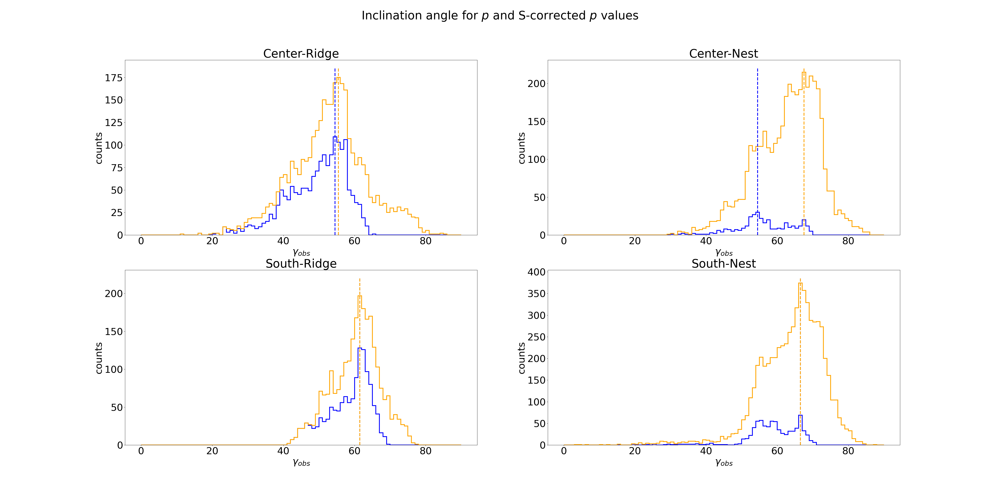
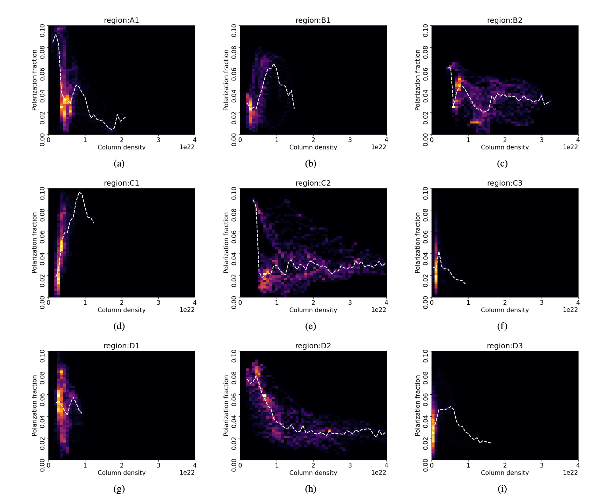

# Summary 
##### Analysis files:
###### Vela C
1. [s dispersion (whole cloud)](vela_C/code/1_S_dispersion_whole_cloud.ipynb)
2. [s dispersion (subregions)](vela_C/code/2_S_dispersion_subregions.ipynb)
3. [Inclination angles](vela_C/code/3_S&p_gamma.ipynb)

###### Orion
1. [Column Density](orion/orion_code/1_orionA_col_density.ipynb)
2. [Polarization Distance](orion/orion_code/2_pol_distance_function.ipynb)

# Abstract
This paper will examine polarimetric observations of the Vela C and Orion A molecular clouds, to gain insight into the 3D structure of their magnetic fields. As molecular clouds have complex structures, factors such as column density, grain alignment efficiency, temperature, and dispersion in the polarization angle must be considered when analyzing the results. An analysis of Vela C is made using the polarization fraction, (𝑝), and the dispersion in the polarization angle, (S), to examine the inclination angle of the cloud’s magnetic field with respect to the plane-of-sky. Additionally, the magnetic field inclination angle will be estimated in four regions of Vela C, based on the varying polarization fraction in each region. In Orion A, previous observations have been made using Faraday rotation to gain insight into the 3D structure of the field in the cloud. Polarimetric observations will be used on Orion A to determine whether the polarization is consistent with these observations. The analysis also shows that regions with higher column density, 𝑁𝐻, tend to have lower polarization fractions, likely due to the reduced efficiency of grain alignment in denser regions. These factors can affect the polarization in the clouds and, therefore, must be taken into consideration when determining the orientation of the magnetic field in these regions. The results show that Vela C has an overall high inclination angle, ranging from 55.5◦-66.5◦ with respect to plane-of-sky, and that the orientation of the field increases towards the south regions of the cloud. The polarization analysis of Orion A showed an increase in the polarization fraction around the main filamentary structure in the cloud, which would indicate a magnetic field inclination angle closer to the plane-of-sky around the cloud.

The entire paper can be found [here](Andrade_M_field_orientation.pdf)

## Key findings
### Vela C molecular cloud polarization angles:
Results of the polarization angles of the Vela C molecular cloud. We tested directly for the polarization angles(shown in yellow), and for the s-corrected angles. The values were histogrammed to determine the median inclination value of each section of the cloud. 

### Orion A 
The analysis on Orion A explored the relationship in column density and polarization fraction in the cloud, as shown by the following 2D histograms.

